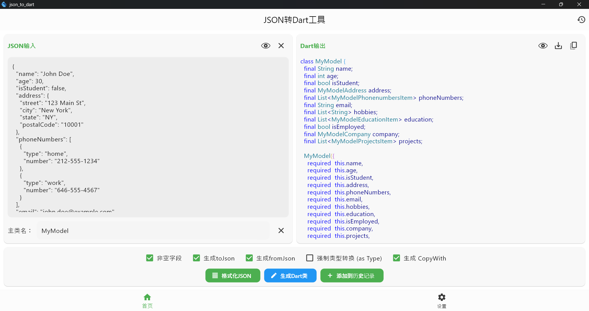
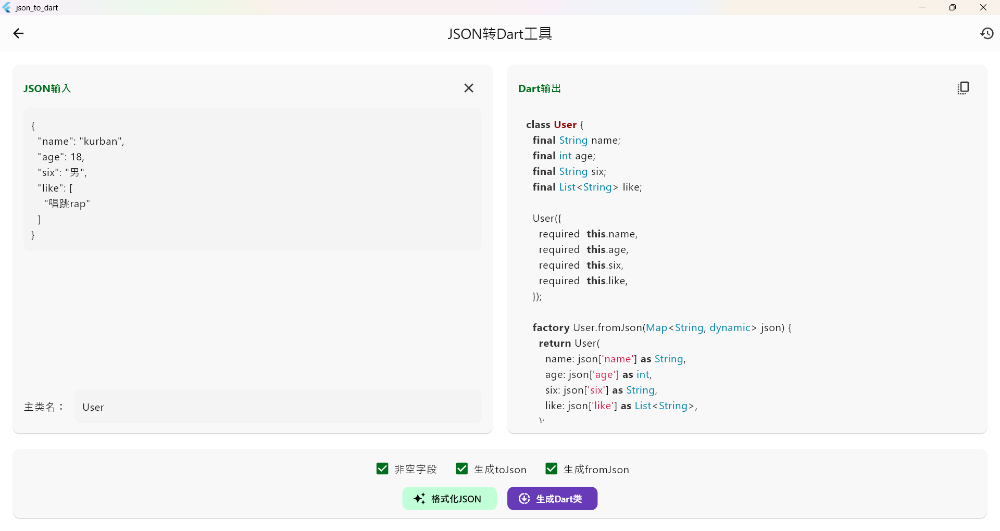
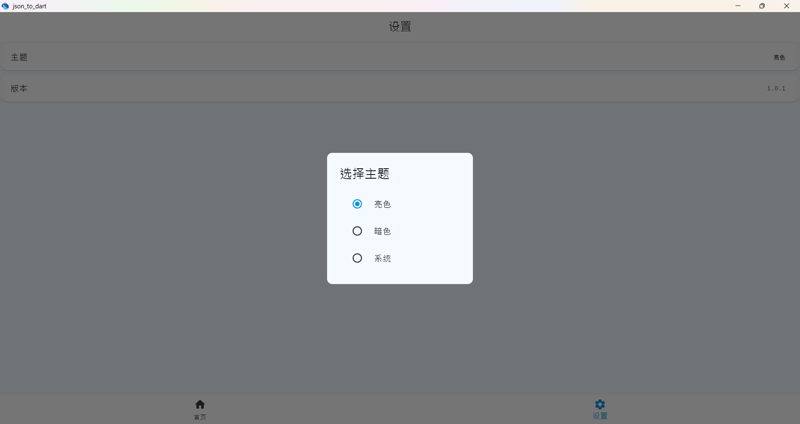
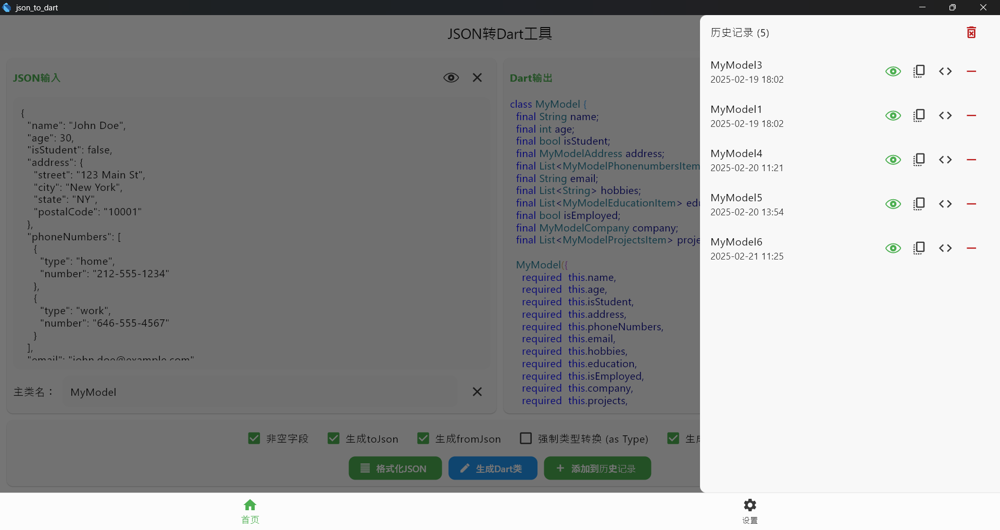
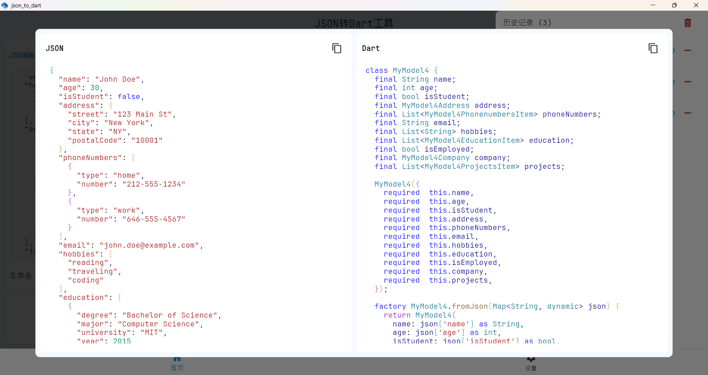

# json_to_dart

A Flutter package for **automatically generating Dart classes from JSON data**, eliminating manual boilerplate coding. Simplify JSON parsing and supercharge your Flutter development workflow!

一个用于**将 JSON 数据自动转换为 Dart 类**的 Flutter 包，告别手动编写样板代码。简化 JSON 解析，提升 Flutter 开发效率！

---

## ✨ Features 主要特性

- **One-click Conversion**  
  Generate complete Dart classes with `fromJson`/`toJson` methods in seconds.  
  **一键转换**：快速生成包含`fromJson`/`toJson`方法的完整 Dart 类。

- **Smart Type Inference**  
  Automatically detects data types (including nested objects and arrays).  
  **智能类型推断**：自动识别数据类型（支持嵌套对象和数组）。

- **Theme Support**  
  Switch between light/dark themes for comfortable coding.  
  **主题支持**：亮色/暗色主题自由切换，舒适编码体验。

- **History Storage**  
  Local storage for conversion history with preview capabilities.  
  **历史记录**：本地存储转换历史，支持随时预览复用。

- **Null Safety**  
  Generates null-safe Dart code by default.  
  **空安全**：默认生成空安全代码。

---

## 📸 Screenshots 界面预览

| Feature 功能                            | Preview 效果展示                                                         |
| --------------------------------------- | ------------------------------------------------------------------------ |
| **Main Interface**  **主界面**        |  输入 JSON ➔ 实时生成 Dart 代码 |
| **Generated Output** **生成结果**    |  支持一键复制/导出        |
| **Theme Switching** **主题切换**     |  亮色/暗色模式自由切换           |
| **History Storage** **历史记录**     |  本地存储+快速检索          |
| **History Preview** **预览历史记录** |  本地存储+可预览            |

---

## 🤝 Contributing 贡献指南

We welcome contributions!  
欢迎参与项目贡献！

1. Fork the repository  
   复刻仓库
2. Create your feature branch  
   创建特性分支
3. Submit a pull request  
   提交 Pull Request

---

## 📄 License 许可证

This project is MIT-licensed.  
本项目采用 MIT 许可证。

---
