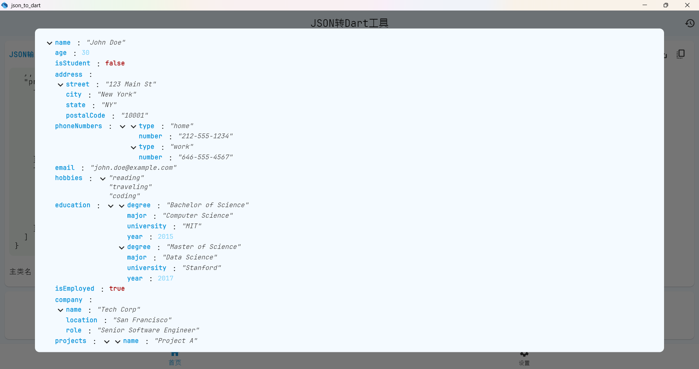
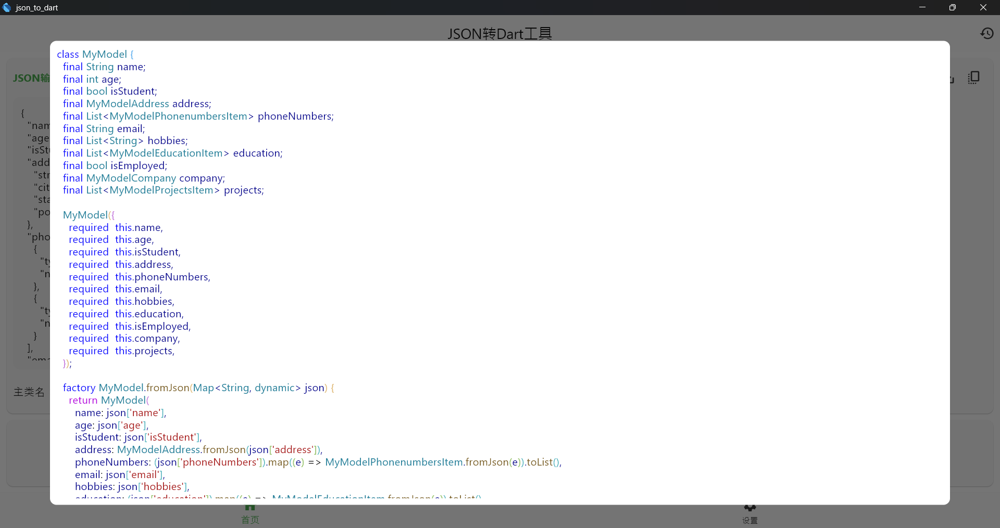

# 概述

本工具是一个基于 Flutter 的 JSON 转 Dart 类生成器，支持多种代码生成选项和历史记录功能。用户可通过输入 JSON 数据快速生成对应的 Dart 模型类代码，并提供代码格式化、保存、复制等操作。

## 使用说明

### 快速开始

1. 在左侧输入区粘贴 JSON 数据
2. 设置主类名（默认：`MainClass`）
3. 选择需要的生成选项
4. 点击 **Generate Dart Class** 生成代码
5. 通过输出区按钮复制或保存代码

### 快捷按钮说明

| 图标 | 功能       | 说明                      |
| ---- | ---------- | ------------------------- |
| 👁️   | 预览       | 格式化展示 JSON/Dart 代码 |
| 📋   | 复制       | 一键复制内容到剪贴板      |
| 💾   | 保存为文件 | 仅桌面/移动端可用         |

---

## 技术细节

### 依赖项

- **状态管理**：`GetX`
- **代码高亮**：`highlight_text`
- **本地化**：`l10n` 国际化支持
- **交互组件**：`CupertinoIcons` 和 `Material Icons`

### 自定义组件

- `HighlightText`：支持 Dart/JSON 语法高亮的文本组件
- `PreviewDialog`：全屏代码预览弹窗

---

## 注意事项

1. Web 端不支持本地文件保存操作
2. 历史记录存储在内存中，页面刷新后失效
3. 强制类型转换选项可能影响空安全性

---

## 📸 Screenshots 界面预览

| Feature 功能                         | Preview 效果展示                                                      |
| ------------------------------------ | --------------------------------------------------------------------- |
| **Main Interface** **主界面**        |  输入 JSON ➔ 实时生成 Dart 代码 |
| **Generated Output** **生成结果**    |  支持一键复制/导出        |
| **Theme Switching** **主题切换**     |  亮色/暗色模式自由切换           |
| **History Storage** **历史记录**     |  本地存储                   |
| **History Preview** **预览历史记录** |  可预览                     |
| **Json Preview** **预览 Json 视图**  |  预览 Json 视图                |
| **Model Preview** **预览生成的类**   |  预览预览生成的类              |

## 主要功能

### 1. 输入区

- **JSON 输入**：支持多行文本输入，提供语法高亮。
- **操作按钮**：
  - 👁️ 预览 JSON（格式化后展示）
  - 🗑️ 清空输入内容
- **主类名设置**：自定义生成的 Dart 类名称。

### 2. 输出区

- **Dart 代码生成**：实时显示转换后的代码，支持语法高亮。
- **操作按钮**：
  - 👁️ 预览完整 Dart 代码（弹窗模式）
  - 💾 保存为文件（Web 端不可用）
  - 📋 复制生成的代码

### 3. 控制区

#### 生成选项（复选框）

- `non-nullable` 字段
- 生成 `toJson()` 方法
- 生成 `fromJson()` 方法
- 强制类型转换
- 生成 `copyWith()` 方法

#### 操作按钮

- **格式化 JSON**：美化输入的 JSON 数据
- **生成 Dart 类**：执行转换操作
- **添加到历史记录**：保存当前转换结果

### 4. 历史记录

- **侧边抽屉**：通过右上角 🕒 图标打开
- **功能支持**：
  - 按时间戳查看历史记录
  - 预览/复制 JSON 或 Dart 代码
  - 删除单条记录或清空全部历史

---
