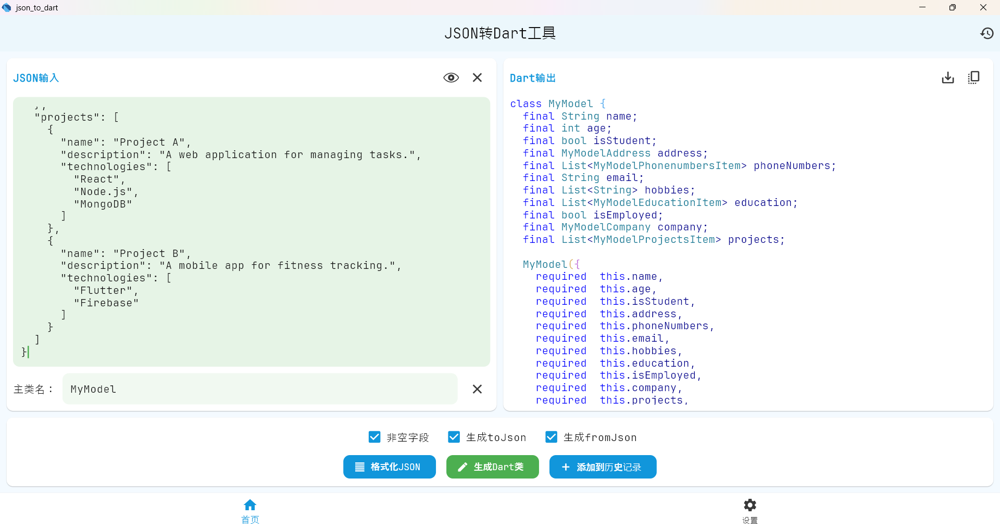

# json_to_dart

`json_to_dart` is a Flutter package that helps you convert JSON data into Dart classes. This tool simplifies the process of working with JSON data in your Flutter applications by generating the necessary Dart code for you. With `json_to_dart`, you can easily parse JSON data and use it in your Flutter projects without writing boilerplate code manually.

`json_to_dart` 是一个 Flutter 包，帮助你将 JSON 数据转换为 Dart 类。这个工具通过为你生成必要的 Dart 代码，简化了在 Flutter 应用中处理 JSON 数据的过程。使用 `json_to_dart`，你可以轻松解析 JSON 数据，并在 Flutter 项目中使用它，而无需手动编写样板代码。

## 页面截图


## 生成效果



## 输入

```json
{
  "name": "kurban",
  "age": 18,
  "six": "男",
  "like": ["唱跳rap"]
}
```

## 输出

```dart
class User {
  final String name;
  final int age;
  final String six;
  final List<String> like;

  User({
    required  this.name,
    required  this.age,
    required  this.six,
    required  this.like,
  });

  factory User.fromJson(Map<String, dynamic> json) {
    return User(
      name: json['name'] as String,
      age: json['age'] as int,
      six: json['six'] as String,
      like: json['like'] as List<String>,
    );
  }

  Map<String, dynamic> toJson() => {
        'name': name,
        'age': age,
        'six': six,
        'like': like,
      };

}
```
